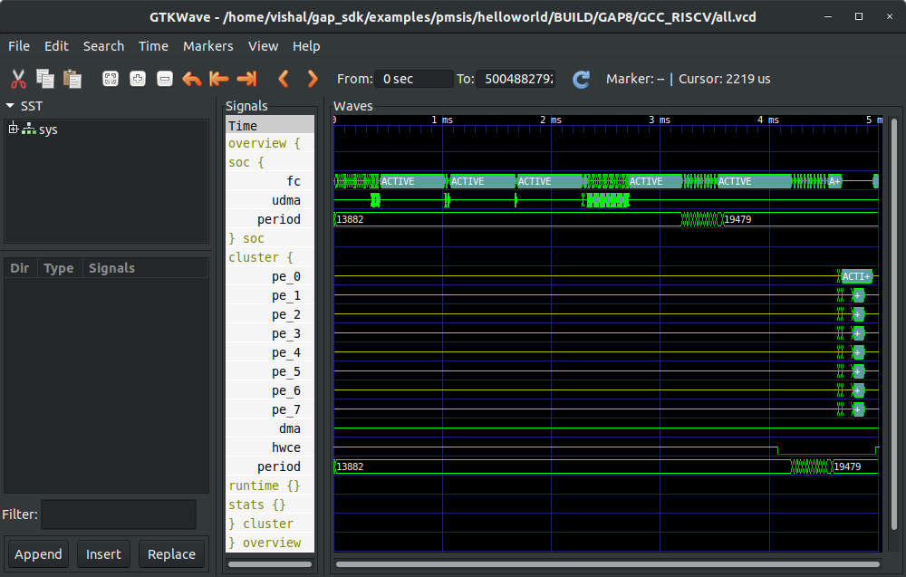

# NANO DRONE PROJECT

### Objective:
To develop an autonomous nano drone with an end-to-end closed-loop visual pipeline for autonomous navigation based on a CNN model taking input from multiple cameras.
Read about the original project at:
https://www.bitcraze.io/tag/ethz/

### Architechture:


#### Motor Control 


##### On-board Sensors
Here is a table with the sensors listed that the crazyflie eventually uses for state estimation:


##### State Estimation
There are 2 state estimators in the crazyflie:
* Complementary Filter
* Extended Kalman Filter

###### 1. Complementary Fiter
The complementary filter is consider a very lightweight and efficient filter which in general only uses the IMU input of the gyroscope (angle rate) and the accelerator. The estimated output is the Crazyflie’s attitude (roll, pitch, yaw) and its altitude (in the z direction). The complementary filter is set as the default state estimator on the Crazyflie firmware.


###### 2. Extended Kalman Filter
The (extended) Kalman filter is an step up in complexity compared to the complementary filter, as it accepts more sensor inputs of both internal and external sensors. It is an recursive filter that estimates the current state of the Crazyflie based on incoming measurements (in combination with a predicted standard deviation of the noise), the measurement model and the model of the system itself.

        
### Setting Up

#### Cloning the Repositories
Go to the home directory
```
$ cd
``` 

Clone the project repository
```
$ git clone --recursive https://github.com/VishalSharma0309/nano_drone
```

Clone the following separately
1. GAP SDK <br>
``` 
$ git clone --recursive https://github.com/VishalSharma0309/gap_sdk
```
2. PULP SDK <br>
```
$ git clone --recursive https://github.com/VishalSharma0309/pulp-sdk
```
3. PULP DroNet <br>
```
$ git clone --recursive https://github.com/VishalSharma0309/pulp-dronet
```

#### For Ubuntu (16 & 18)

##### Setting up GAP-SDK
Follow the steps mentioned in readme_GAPSDK.txt

##### Setting up PULP-SDK & Compiling PULP-DRONET (incomplete)
Follow the steps mentioned in readme_pulpDroNet.txt

#### For CentOS 7 & Other Linux Distros
Follow the steps mentioned in readme_setupCentOS.txt (incomplete)

### Running Programs on GVSOC

#### Setting-up & using GVSOC: Documentation
Please read readme_gvsoc.txt 

```
$ source ~/gap_sdk/configs/gapuino.sh 
$ cd <to the application to run>
$ make all run platform=gvsoc
```
#### Run an application with VCD traces

VCD traces is used to see what happens on the chip
```
make all run platform=gvsoc runner_args="--vcd"
```

This command produces a Gtkwave script which can be opened using a command described in the command result. Something like:
```
gtkwave /home/vishal/gap_sdk/examples/pmsis/helloworld/BUILD/GAP8_V2/GCC_RISCV/view.gtkw
```
Example:

 
### Repository Structure:

    nano_drone
    │   README.md
    │   readme_GAPSDK.txt (to setup GAP SDK)
    |   readme_gvsoc.txt (to setup and use GVSOC on GAP SDK and PULP SDK)
    |   readme_multiCameraInterfacing.txt (research on interfacing multi-cameras on GAP SoC)
    |   readme_pulpDroNet.txt (to setup PULP DroNet)
    |   readme_setupCentOS.txt (to setup toolchain & SDK on centOS)
    |   readme_vncsteps.txt (to vnc into remote PCs)
    |   tasks.txt (weekly meeting notes)
    │   environment.yml (yml file for GAP-SDK conda environment) (not working)
    |   gap_env.yml (yml file for both GAP & PULP-SDK conda environment) (not working)
    |   pulpsdk.yml (yml file for PULP-SDK conda environment) (working)
    |   setup.sh (automated script to setup GAP-SDK in any linux distro) (under progress)
    |   start.sh (automated script to run bofore using GAP-SDK)
    |
    └───gap_riscv_toolchain_ubuntu_18
    │   │   install.sh
    │   │   README.md
    │   │
    │   └───bin
    │   └───include    
    │   └───lib    
    │   └───libexec    
    │   └───riscv32-unknown-elf
    |   └───share
    |
    └───gap_sdk
    │   │   requirements.txt
    │   │   README.md
    |   |   sourceme.sh 
    │   │
    │   └───applications
    |   |   └───audio_4chan_vocIP
    |   |   └───BilinearResize
    |   |   └───CannyEdgeDetection
    |   |   └───FaceDetection
    |   |   └───jpeg_encoder
    |   |   └───MultiScalePedestrianDetector
    |   |   └───WaterMeter
    │   └───build    
    │   └───configs    
    │   └───docs    
    │   └───examples
    |   |   └───autotiler
    |   |   └───native
    |   |   |   └───freeRTOS
    |   |   |   └───mbed
    |   |   |   └───mbed-gapoc
    |   |   |   └───pulpos
    |   |   └───nntool
    |   |   └───pmsis
    |   |       └───devices
    |   |       └───helloworld
    |   |       └───test_features
    |   |       └───test_periph
    |   |        
    |   └───gvsoc
    |   └───install
    |   └───libs
    |   └───PlatformIO
    |   └───rtos
    |   └───tools
    |
    └───Papers (relevant research papers)
    |
    └───pmsis_api
    |   |   LICENSE
    |   |
    |   └───docs
    |   └───include
    |   └───jenkins
    |   └───tools
    |
    └───pulp-builder
    |   |   README.md
    |   |
    |   └───build
    |   └───install
    |   └───json-tools
    |   └───plptest
    |   └───pulp-configs
    |   └───pulp-runtime
    |   └───runner
    |   └───scripts
    |
    └───pulp-dronet
    |   |   README.md
    |   |   LICENSE_README.md
    |   |   LICENSE.apache.md
    |   |
    |   └───bin
    |   └───dataset
    |   └───imgs
    |   └───PULP-Shield
    |   └───src
    |   └───wieghts
    |
    └───pulp-riscv-gnu-toolchain
    |   |   configure  
    |   |   configure.ac
    |   |   LICENSE
    |   |   Makefile.in
    |   |   Makefile.pulp
    |   |   README.md
    |   |   riscv.ld
    |   └───linux-headers
    |   └───riscv-binutils-gdb
    |   └───riscv-dejagnu
    |   └───riscv-gcc
    |   └───riscv-glibc
    |   └───riscv-newlib
    |   └───scripts
    |
    └───pulp-sdk
    |   |   ci.makefile
    |   |   get-platform
    |   |   init.csh
    |   |   init.sh
    |   |   LICENSE
    |   |   Makefile
    |   |   project.cfg
    |   |   README.md
    |   |   versions.cfg
    |   └───chips
    |   └───configs
    |   └───install
    |   └───json-tools
    |   └───plptest
    |   └───pulp-configs
    |   └───pulp-tools
    |   └───scripts
    |
    └───pulpissimo
    |
    └───reference_manuals
    |        
    └───spif-driver
    |
